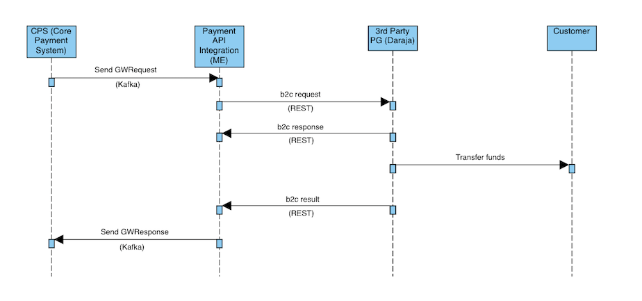
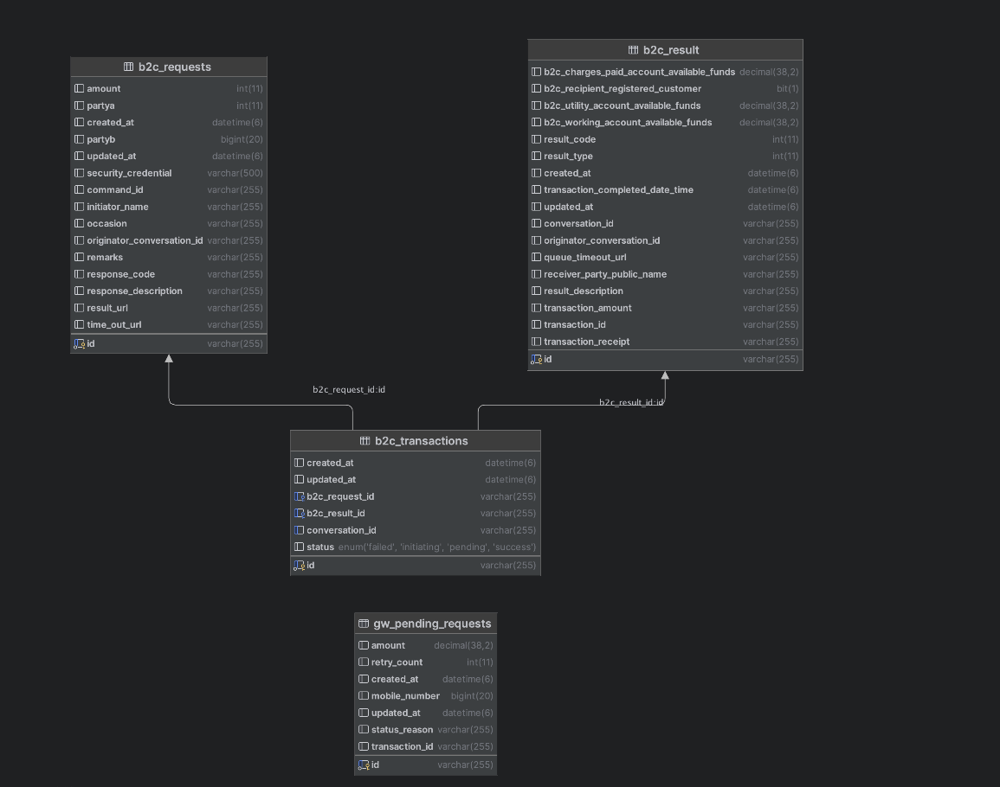

# Process Flow


### [Swagger](http://localhost:6793/payment-api/swagger-ui/index.html)
Open Api Swagger documentation

# MariaDB
```bash
docker compose up -f mariadb/maria-db-docker-compose.yaml -d
```

## Schema




# Kafka
```bash
docker compose up -f kafka/kafka-docker-compose.yaml -d
```

# Deploying

Code changes will be picked up by building a new image or passing --build service to **docker compose up**

### Start Whole Infrastructure
```bash
docker compose -f payment-docker-compose.yaml down up --build -d
```

### Stop The Whole Infrastructure
```bash
docker compose -f payment-docker-compose.yaml down -v 
```

### Start without building image
```bash
docker compose -f payment-docker-compose.yaml up -d
```

### Stop without deleting volume
```bash
docker compose -f payment-docker-compose.yaml down
```

### Watch Logs
```bash
docker compose -f payment-docker-compose.yaml logs -f
```

# Environment Variables
The following environment variables need to be provided in order for the application to run smoothly. 
Default values have been given below
```.dotenv
spring.datasource.protocol=mariadb
spring.datasource.host=mariadb
spring.datasource.username=tanda
spring.datasource.password=tanda
spring.datasource.database=payments
spring.datasource.port=3306
spring.datasource.driver-class-name=org.mariadb.jdbc.Driver
spring.jpa.hibernate.ddl-auto=create-drop
daraja.auth.url=https://sandbox.safaricom.co.ke/oauth/v1/generate?grant_type=client_credentials
daraja.b2c.url=https://sandbox.safaricom.co.ke/mpesa/b2c/v3/paymentrequest
daraja.result.url=http://localhost:6793/b2c/result
daraja.key=eiaKJaH41Twej5U0KV4ZwHNtc5ABYYDW
daraja.secret=6sAGXzDCbByAAdrF
initiator.name=testapi
security.credential=CA0CWjEkPVoCPNHC29So/LbpYFz9t3zQIj8a+x4rv2Lni1v4x0vRl8hdWtIA+T5K5EM5+ZR2anHmdISJt3m4+I4HRI+yuWf/M58scZQsRWOy/7+ha2U1DABN5aHC2oqG9H0oCJUEf34qop1RRZAFXnalirycx0iUu34KDtvWlhp844kcSXW7wFl+MMfinRsNRrKz7cBnE4T+YrzrrDGbC7HM+SEh7Az2yGyLjZ3IPbGBdOREGe2DuD7Y4gQ3N/etbd1iIgheQfESMJ/RfdM0jG/DlBEPUT6zYevJBJyJIcx8ddk1k9oS0Xu20zvLo1oRRN9WFSCxLibL/k+YZPv7Wg==
business.short-code=600980
kafka.servers=kafka:9092
```